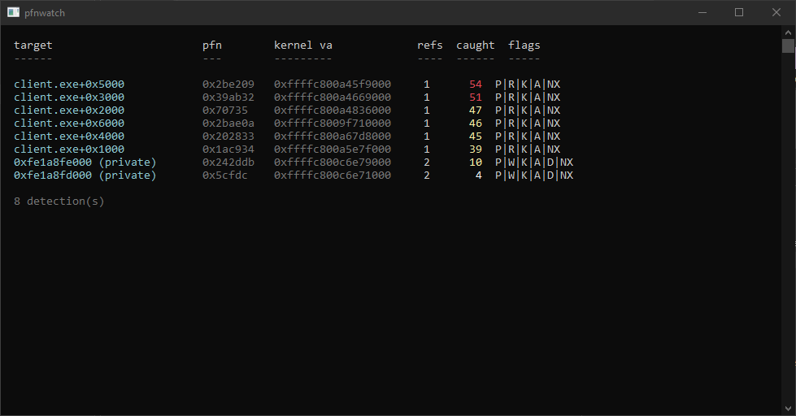

## what is this

pfnwatch is a proof of concept for a detection technique discussed in the game security community. the idea is that any remote memory access that goes through Windows paging has to create a PTE. if that PTE points to a physical page owned by your process, someone is accessing your memory

I haven't confirmed whether anti cheats deploy this exact technique, but I  do know many monitor PFN reference counts and pool tags. both of these work off kernel recording that can be spoofed or avoided. PTE scanning is a lot harder to beat as the cpu has to create the mapping to access the memory, the only ways around it are to not read remotely at all, or exploit holes in the specific implementation

## how it works

the driver attaches to the protected process and walks its page tables to build a bitmap of every PFN it owns. prototype PTEs and non active pages are filtered out to minimize false positives and speed it up. In production you would user other ways of filtering false positives but for a PoC this is fine

once the bitmap is built, the driver scans all kernel page tables looking for any PTE whose PFN is in our bitmap. if a kernel PTE points to one of the process physical pages, someones accessing our memory. we then record the kernel VA, PTE flags, and PteAddress so we can resolve which address in the target process is being accessed, which is useful for getting rid of false positives and could be used for honey potting

## what it catches

any kernel mode code that maps a target process's physical memory will create a PTE that pfnwatch will find. common APIs this covers:

- `MmMapIoSpace` / `MmMapIoSpaceEx`
- `MmMapLockedPages` / `MmMapLockedPagesSpecifyCache`
- `MmCopyMemory` 
- direct pte writes

this does **not** catch:
- anything that doesn't create a pte, so this would include DMA, hypervisors, KeStackAttachProcess, or code already executing in the target
- temporary mappings that unmap before the next scan tick, though persistent access (like cheats do) will be caught eventually
  
## output

